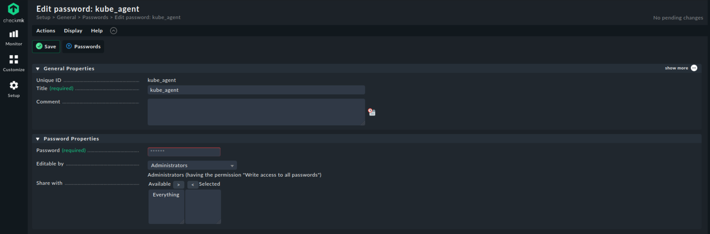
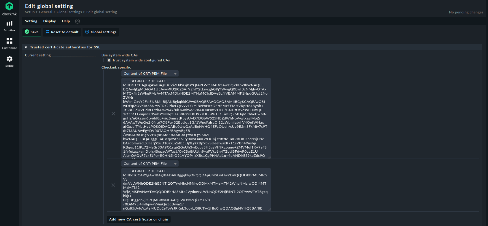
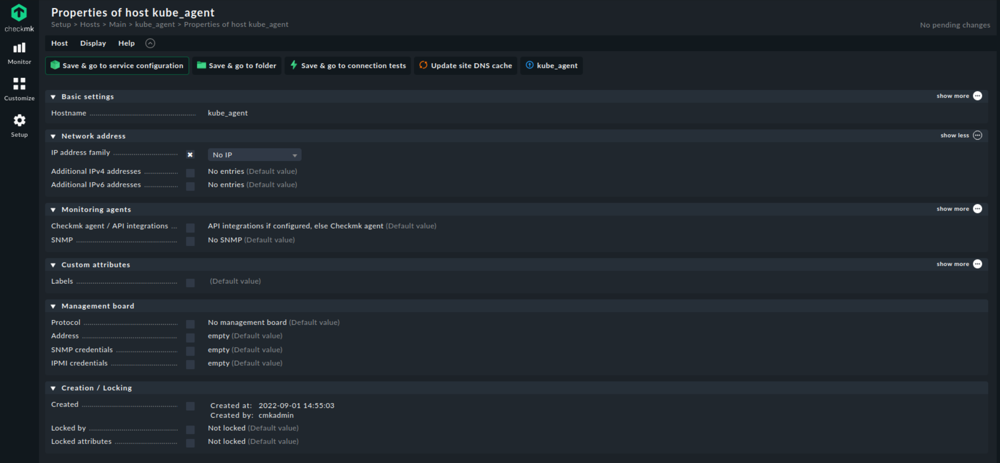
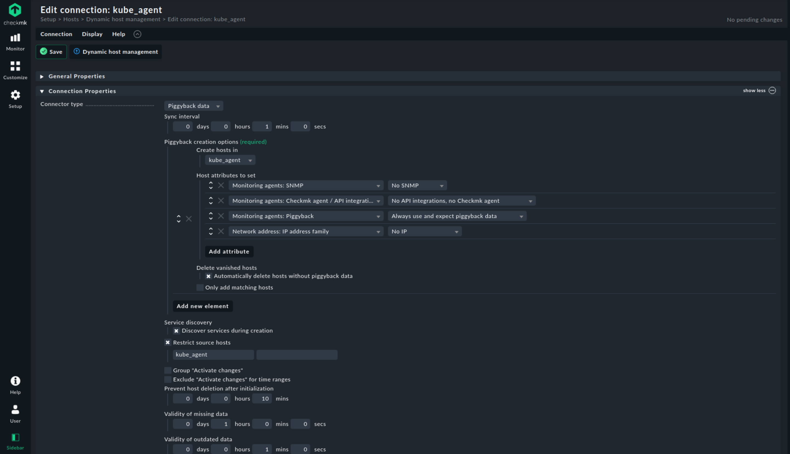
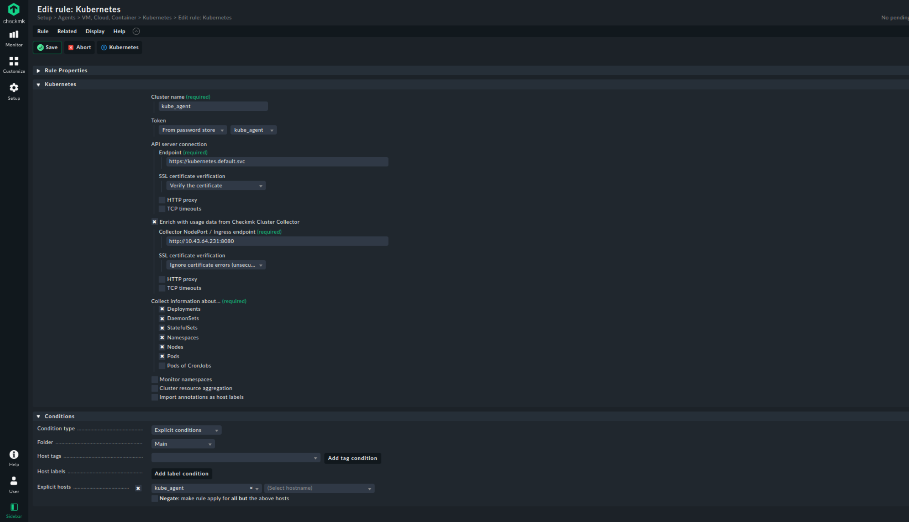
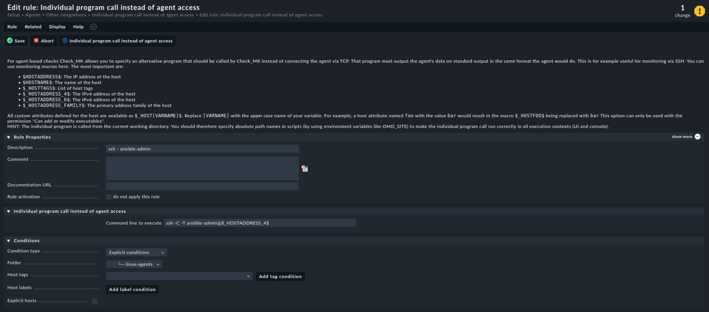

# SETUP

```sh
    MVladislav
```

---

- [SETUP](#setup)
  - [files to changes](#files-to-changes)
  - [client monitoring setups](#client-monitoring-setups)
    - [setup kubernetes agent](#setup-kubernetes-agent)
      - [add password](#add-password)
      - [add certificate](#add-certificate)
      - [add empty host + folder](#add-empty-host--folder)
      - [add piggyback](#add-piggyback)
      - [add kubernetes service monitoring](#add-kubernetes-service-monitoring)
    - [linux agent](#linux-agent)
    - [proxmox](#proxmox)
  - [References](#references)

---

## files to changes

- [configmap.yaml](configmap.yaml)
  - name for your instance
- [credentials.yaml](credentials.yaml)
  - login password
- [ingress.yaml](ingress.yaml)
  - domain name
- [persistentvolumeclaim.yaml](persistentvolumeclaim.yaml)
  - size for your volume

## client monitoring setups

### setup kubernetes agent

code from here: <https://github.com/tribe29/checkmk_kube_agent/tree/main/deploy/charts/checkmk>\
with own changes here: <https://github.com/MVladislav/checkmk_kube_agent/tree/main/deploy/charts/checkmk>

#### add password

get password from kubectl-token:

```sh
$kubectl get secret checkmk-token -n checkmk -o=jsonpath='{.data.token}' | base64 --decode
```

open `Setup > General > Passwords > Add password`\
and add the password



#### add certificate

get cert from kubectl-token:

```sh
$kubectl get secret checkmk-token -n checkmk -o=jsonpath='{.data.ca\.crt}' | base64 --decode
```

open `Setup > General > Global settings > Site management > Trusted certificate authorities for SSL`
and add your cert as new one



#### add empty host + folder

add an new folder `Setup > Hosts > Add folder` go into it

create new host `Setup > Hosts > Add host`



#### add piggyback

open `Setup > Hosts > Dynamic host management > Add connection`



#### add kubernetes service monitoring

open `Setup > Agents > VM, Cloud, Container > Kubernetes`

add as api-server the internal hostname: `https://kubernetes.default.svc`\
and for enrich the data, user also the internal service-ip from **checkmk-monitoring-cluster-collector**
with the default port `8080`.

```sh
$kubectl get service -n checkmk | grep cluster
```



### linux agent

install agent:

```sh
$wget <URL>.deb
$sudo apt install <FILE>.deb
$sudo apt install xinetd
```

config access over ssh:

> Notes:
>
> > private-key: under checkmk-server in `/omd/sites/<CHECKMK-ID>/.ssh/` path
> > public-key: under client in `~/.ssh/authorized_keys`

```sh
$mkdir -p -m 700 ~/.ssh
: 'ssh-keygen -t ed25519 -C "checkmk" -f /omd/sites/checkmk/.ssh/id_ed25519 && chown checkmk:checkmk /omd/sites/<CHECKMK-ID>/.ssh/id_ed25519'
$echo 'command="sudo /usr/bin/check_mk_agent" ssh-ed25519 AAAAC3NzaC1lZDI1NTE5AAAAIDbCvrcLAhs9LUojEr1oyqRbyp/tCjRyybu/90OcYSsE checkmk' >> ~/.ssh/authorized_keys
$chmod 600 ~/.ssh/authorized_keys
$sed -i 's/disable        = no/disable        = yes/g' /etc/check_mk/xinetd-service-template.cfg
$sudo systemctl stop cmk-agent-ctl-daemon.service
$sudo systemctl disable cmk-agent-ctl-daemon.service
$sudo systemctl stop check-mk-agent.socket
$sudo systemctl disable check-mk-agent.socket
$sudo systemctl restart xinetd
```

add ssh command:

open `Setup > Agents > Other integrations> Custom integrations > Individual program call instead of agent access`



### proxmox

setup linux agent first (see above for how-to)

setup group:

```sh
$pveum group add checkmk
```

setup permission:

```sh
$pveum aclmod / -group checkmk -role PVEAuditor
```

create an pve user:

```sh
$pveum user add checkmk@pve --password <password> --groups checkmk
```

---

## References

- <https://github.com/tribe29/kubernetes/blob/main/checkmk-server/manifests/checkmk-server_deployment.yaml>
- <https://docs.checkmk.com/latest/en/monitoring_kubernetes.html>
- <https://github.com/tribe29/checkmk_kube_agent/tree/main/deploy/kubernetes>
- <https://kubernetes.io/docs/tasks/run-application/access-api-from-pod/>
- <https://github.com/tribe29/checkmk_kube_agent/tree/main/deploy/charts/checkmk>
- <https://docs.checkmk.com/latest/de/agent_linux.html>

---

**☕ COFFEE is a HUG in a MUG ☕**
