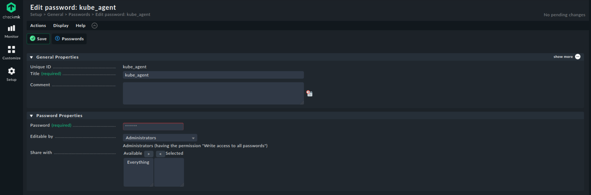
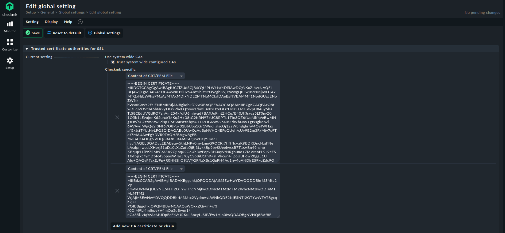
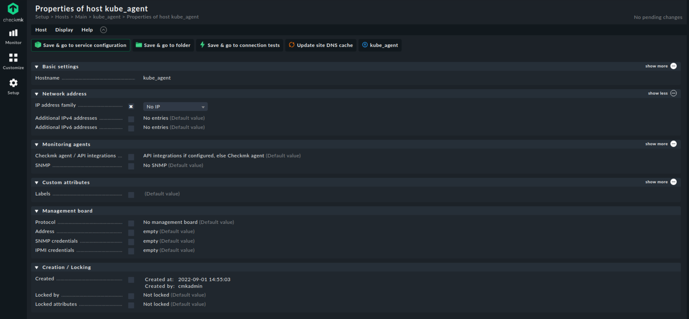
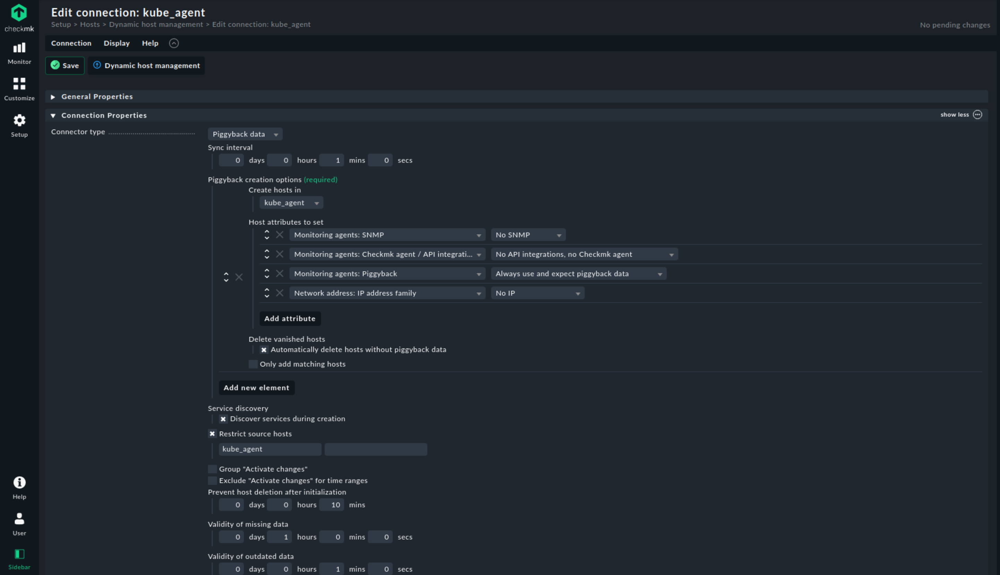
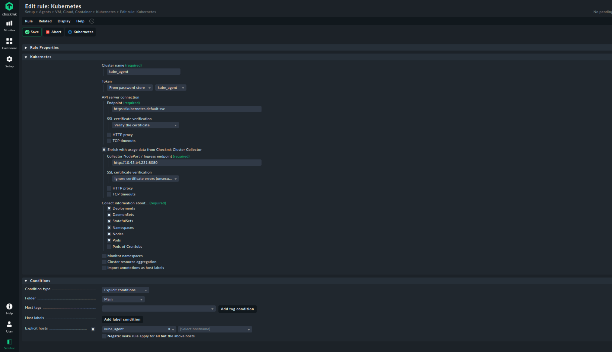

# SETUP

```sh
    MVladislav
```

---

- [SETUP](#setup)
  - [files to changes](#files-to-changes)
  - [setup kubernetes agent](#setup-kubernetes-agent)
    - [add password](#add-password)
    - [add certificate](#add-certificate)
    - [add empty host + folder](#add-empty-host--folder)
    - [add piggyback](#add-piggyback)
    - [add kubernetes service monitoring](#add-kubernetes-service-monitoring)
  - [References](#references)

---

## files to changes

- [configmap.yaml](configmap.yaml)
  - name for your instance
- [credentials.yaml](credentials.yaml)
  - login password
- [ingress.yaml](ingress.yaml)
  - domain name
- [persistentvolumeclaim.yaml](persistentvolumeclaim.yaml)
  - size for your volume

## setup kubernetes agent

code from here: <https://github.com/tribe29/checkmk_kube_agent/tree/main/deploy/charts/checkmk>\
with own changes here: <https://github.com/MVladislav/checkmk_kube_agent/tree/main/deploy/charts/checkmk>

### add password

get password from kubectl-token:

```sh
$kubectl get secret checkmk-token -n checkmk-n -o=jsonpath='{.data.token}' | base64 --decode
```

open `Setup > General > Passwords > Add password`\
and add the password



### add certificate

get cert from kubectl-token:

```sh
$kubectl get secret checkmk-token -n checkmk-n -o=jsonpath='{.data.ca\.crt}' | base64 --decode
```

open `Setup > General > Global settings > Site management > Trusted certificate authorities for SSL`
and add your cert as new one



### add empty host + folder

add an new folder `Setup > Hosts > Add folder` go into it

create new host `Setup > Hosts > Add host`



### add piggyback

open `Setup > Hosts > Dynamic host management > Add connection`



### add kubernetes service monitoring

open `Setup > Agents > VM, Cloud, Container > Kubernetes`

add as api-server the internal hostname: `https://kubernetes.default.svc`\
and for enrich the data, user also the internal service-ip from **checkmk-monitoring-cluster-collector**
with the default port `8080`.



---

## References

- <https://github.com/tribe29/kubernetes/blob/main/checkmk-server/manifests/checkmk-server_deployment.yaml>
- <https://docs.checkmk.com/latest/en/monitoring_kubernetes.html>
- <https://github.com/tribe29/checkmk_kube_agent/tree/main/deploy/kubernetes>
- <https://kubernetes.io/docs/tasks/run-application/access-api-from-pod/>
- <https://github.com/tribe29/checkmk_kube_agent/tree/main/deploy/charts/checkmk>

---

**☕ COFFEE is a HUG in a MUG ☕**
